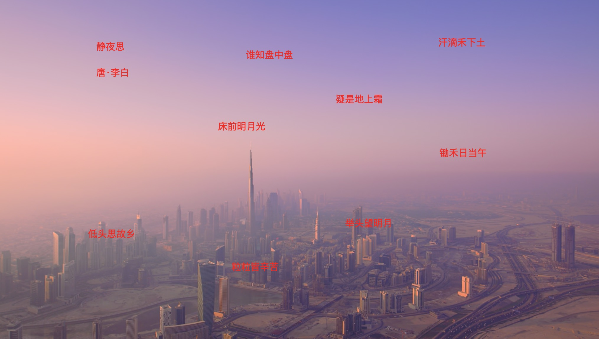

# 实现图片文字识别（OCR 技术）功能

## 展示



> 原尺寸文字识别

<video autoplay controls src="https://github.com/user-attachments/assets/697866b5-f8bb-46fc-9286-fded36f0464a" title="原尺寸"></video>

> 缩放比例文字识别

<video autoplay controls src="https://github.com/user-attachments/assets/a85d2e52-0343-404e-a089-b75de1ad31f9" title="缩放尺寸"></video>

**日常使用到的软件中的图片文字识别功能并且支持复制**

微信、钉钉、语雀...

## OCR 是什么

> Optical Character Recoginition 光学字符识别

一种将图像中的文字信息转换为`可编辑`、`可搜索`的`电子文本`的技术

### 常见的 OCR 技术工具

> 开源

- Tesseract
- EasyOCR
- PaddleOCR
- ...

> 商用

API 形式

- 阿里云 OCR
- 腾讯 OCR
- ...

## 实现

如何得到图片识别的文字以及位置信息

- Python <= 3.12
  - 使用 pyenv
  - 项目管理
    - pip
  - 依赖
    - fastapi
    - paddleocr3.0.1
- 前端
  - HTML
  - CSS
  - JavaScript

## 思考

- 图片
  - 识别文字
  - 文字大小（长宽）
  - 位置
- 处理数据
  - 定位
    - `absolute`
    - `left`
    - `top`
  - 字体
    - `font-size`

## Python

使用 Python 后端接口数据获取

### 环境搭建

安装 `Python3.12` 环境

> 创建项目

```shell
mkdir demo01
cd demo01
```

> 创建虚拟环境

```shell
python3.12 -m venv .venv

# macos
source .venv/bin/activate
# if deactive
# deactive
```

> 安装相关依赖

- [PaddleOCR](https://paddlepaddle.github.io/PaddleOCR/latest/)
- [PaddleX](https://paddlepaddle.github.io/PaddleX/latest/index.html)

```shell
pip install "fastapi[standard]"

# cpu 版本
pip install paddlepaddle==3.0.0 -i https://www.paddlepaddle.org.cn/packages/stable/cpu/
pip install paddleocr
```

> requirements.txt

- 显示依赖
- 依赖锁定

```shell
pip freeze > requirements.txt
```

- 指定依赖

```shell
pip install -r requirements.txt
```

### 关键代码

[代码地址](https://github.com/LIUeng/pip-ocr/blob/main/app/api/routes/ocr.py)

```python
from paddleocr import PaddleOCR
from PIL import Image
import os

# 获取图片尺寸大小
def get_image_det(input: str):
    result = {}

    result['size'] = os.path.getsize(input)
    img_info = Image.open(input)
    originWidth,originHeight = img_info.size

    result['originWidth'] = originWidth
    result['originHeight'] = originHeight

    return result

# 获取图片文字
def get_image_ocr(input: str):
    ocr = PaddleOCR(use_doc_orientation_classify=False, use_doc_unwarping=False, use_textline_orientation=False, text_det_unclip_ratio=1)
    result = ocr.predict(input=input)

    # 数据格式转换
    _result = get_image_det(input)
    for res in result:
        locations = []
        # 识别的文字
        rec_texts = res["rec_texts"]
        # 文字四个方向的坐标信息
        rec_boxes = res["rec_boxes"]
        # 匹配度 0<x<1 接近1说明识别度越高
        rec_scores = res['rec_scores']
        for i, v in enumerate(rec_boxes):
            [left, top, right, bottom] = v
            locations.append({
                "text": rec_texts[i],
                "x": float(left),
                "y": float(top),
                "width": float(right - left),
                "height": float(bottom - top),
                "confidence": float(rec_scores[i])
            })
        _result["locations"] = locations

    return _result
```

### 运行

```shell
fast run --reload app/main.py
```

> 可能遇到的问题

- ModuleNotFoundError: No module named 'distutils'

```shell
# 需要安装 setuptools
pip install setuptools
```

## 前端

> 获取以下数据并处理

[数据格式可参考 PaddleOCR 输出 JSON](https://github.com/LIUeng/pip-ocr/blob/main/output/test_res.json)

```json
{
  "size": 234138,
  "originWidth": 2028,
  "originHeight": 1148,
  "locations": [
    {
      "text": "汗滴禾下土",
      "x": 1484,
      "y": 126,
      "width": 158,
      "height": 34,
      "confidence": 0.9932206273078918
    },
    {
      "text": "静夜思",
      "x": 326,
      "y": 142,
      "width": 94,
      "height": 30,
      "confidence": 0.9981958270072937
    },
    {
      "text": "谁知盘中盘",
      "x": 833,
      "y": 170,
      "width": 157,
      "height": 29,
      "confidence": 0.9891821146011353
    },
    ...
  ]
}
```

### 注意点

- 使用绝对定位
  - left 图片显示宽度/图片实际宽度 \* x(偏移量)
  - top 图片显示高度/图片实际高度 \* x(偏移量)
- 文字透明可复制
  - color: transparent
- font-size 计算
  - 图片显示宽度（高度）/图片实际宽度（高度） \* 文字的高度

### 实现

[代码地址](https://github.com/LIUeng/pip-ocr/blob/main/index.html)

```html
<div id="container">
  <div id="ocr-container"></div>
</div>
```

```js
const container = document.getElementById("container");
const ocr_container = document.getElementById("ocr-container");
const input_img = "./images/test.jpg";
// create img
const appendImg = (width) => {
  const img = document.createElement("img");
  img.src = input_img;
  img.width = width;
  container.appendChild(img);
};
// fetch ocr_data
fetch("http://localhost:8000/ocr/image")
  .then((res) => res.json())
  .then((res) => {
    const ocr_data = res.data;
    // 原尺寸显示
    const showWidth = ocr_data.originWidth;
    // 缩小显示
    // const showWidth = 512;
    // append img
    appendImg(showWidth);
    // create ocr text
    ocr_data.locations.forEach((ocr) => {
      // 过滤空字符
      if (!ocr.text) return;
      const div = document.createElement("div");

      div.className = "ocr-text";
      div.style.top = (ocr.y / ocr_data.originHeight) * 100 + "%";
      div.style.left = (ocr.x / ocr_data.originWidth) * 100 + "%";
      div.style.fontSize =
        (showWidth / ocr_data.originWidth) * ocr.height + "px";
      div.textContent = ocr.text;

      ocr_container.appendChild(div);
    });
  });
```

```css
#container {
  position: relative;
  display: inline-flex;
}
#ocr-container {
  position: absolute;
  top: 0;
  left: 0;
  right: 0;
  bottom: 0;
}
.ocr-text {
  position: absolute;
  color: transparent;
}
```

## 总结

> 为什么选择 PaddleOCR

开源，PaddleOCR 更新活跃，模型支持更新（PP-OCRv5 PP-StructureV3 PP-ChatOCRv4 等等），参数可进行微调

> 文字位置识别偏差

自行实现文字位置大小宽度高度会有点偏差，但不影响识别复制（微信、钉钉、语雀等工具识别图片文字整齐度高）

## END
